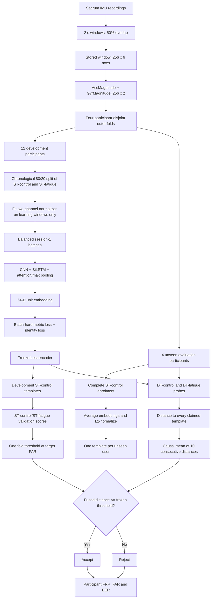

# Condition-Invariant Gait Verification: Implemented Architecture

## 1. Purpose

The statistical-feature RBF-SVM is the problem-assessment baseline. The
proposed system is a separate population-trained verifier that asks:

> Can an encoder learn useful fatigue variation from development participants,
> then enrol a previously unseen person from normal walking only and verify
> that person during a later dual-task visit?

The proposed system does not overwrite the SVM models, features, or results.

## 2. Implemented design in one sentence

A shared CNN-BiLSTM-attention encoder learns identity embeddings from
development participants' ST-control and ST-fatigue magnitude signals; an
unseen participant creates one template from their complete ST-control
recording, and DT-control/DT-fatigue probes are accepted when their distance
from the claimed template is below one frozen fold threshold.

## 3. Data boundaries

| Population/stage | Conditions used | Purpose |
|---|---|---|
| Development learning | ST-control and ST-fatigue | Fit normalization and encoder weights |
| Development validation | Held-out ST-control and ST-fatigue | Early stopping and threshold calibration |
| Unseen-user enrolment | Complete ST-control recording | Create one user template |
| Final evaluation | DT-control and DT-fatigue | Cross-visit genuine and impostor probes |

For evaluation participants, ST-fatigue is not used. Their DT-control and
DT-fatigue data never enter model fitting, normalization, early stopping,
threshold selection, or enrolment.

## 4. End-to-end flow



## 5. Input contract

The package loads the raw sacrum windows created by `src/02_preprocess.py`.
The saved channel order is:

```text
GyrX, GyrY, GyrZ, AccX, AccY, AccZ
```

Each saved window has 256 samples and six axes. At load time, the dataset
converts every timestamp to two magnitude values:

\[
m_a(t)=\sqrt{AccX(t)^2+AccY(t)^2+AccZ(t)^2}
\]

\[
m_g(t)=\sqrt{GyrX(t)^2+GyrY(t)^2+GyrZ(t)^2}.
\]

The network receives a `256 x 2` time series ordered as `AccMagnitude,
GyrMagnitude`. It does not receive the six axes, eight axis-plus-magnitude
channels, or the SVM statistical-feature table.

Fixed window properties:

- sampling rate: 128 Hz;
- duration: 2 seconds;
- samples per window: 256;
- hop: 128 samples (1 second);
- overlap: 50%;
- sensor: sacrum; and
- participants: 16, including the corrected `sub_07` ST-control recording.

## 6. Participant-disjoint outer folds

Participants are sorted and assigned deterministically to four outer folds.
Each run contains 12 development participants and four completely unseen
evaluation participants. Across the four runs, every participant is evaluated
exactly once.

```text
Fold 1: sub_01, sub_06, sub_10, sub_14
Fold 2: sub_02, sub_07, sub_11, sub_15
Fold 3: sub_03, sub_08, sub_12, sub_17
Fold 4: sub_05, sub_09, sub_13, sub_18
```

An evaluation participant cannot appear in development under another
condition.

## 7. Chronological development split

Only ST-control and ST-fatigue are prepared for development. For every
development participant and condition, chronological block IDs are divided
80/20 into learning and validation portions.

The split uses complete blocks rather than randomly mixed windows. Learning
windows at the boundary are removed until no raw sample can occur in both
partitions, because adjacent 2-second windows share one second of signal.

The learning portion fits normalization and encoder weights and creates
development ST-control templates. The validation portion supports early
stopping, checkpoint selection, and threshold calibration.

## 8. Two-channel normalization

One mean and standard deviation are calculated for each magnitude channel
using development-learning windows only:

\[
x' = \frac{x-\mu_{development}}{\sigma_{development}}.
\]

These statistics are frozen and reused for development validation,
evaluation-user enrolment, and final probe scoring. Evaluation participants
never contribute to normalization.

## 9. Encoder architecture

```text
Input: 256 x 2 magnitude time series
  -> Conv1D: 2 to 32, kernel 7, BatchNorm, GELU
  -> Conv1D: 32 to 64, kernel 5, stride 2, BatchNorm, GELU
  -> Conv1D: 64 to 96, kernel 3, stride 2, BatchNorm, GELU
  -> bidirectional LSTM: 64 units per direction
  -> attention-weighted temporal pooling
  -> maximum temporal pooling
  -> concatenate both pooled vectors
  -> dense 256 to 128, GELU, dropout 0.25
  -> dense 128 to 64
  -> L2-normalized 64-D embedding
```

The convolutions learn local motion patterns. The BiLSTM models their temporal
order. Attention pooling emphasizes informative time steps, while max pooling
retains the strongest learned responses. L2 normalization places every
embedding on the unit sphere.

## 10. Balanced batches and online hard mining

The final implementation does not train from pre-generated triplet files. It
samples balanced session-1 batches and forms hard comparisons inside each
batch.

Default batch construction:

- eight development participants without replacement;
- three ST-control windows per selected participant;
- three ST-fatigue windows per selected participant; and
- 48 windows in total.

Only ST-control windows act as anchors. For each anchor, the positive
candidates are all other ST-control and ST-fatigue windows belonging to the
same participant. The farthest is the hard positive. All ST-control and
ST-fatigue windows belonging to other selected participants are negative
candidates. The closest is the hard negative.

Fatigue variation is therefore learned from development users, while a new
user is still enrolled using normal walking only.

## 11. Training objectives

The default metric objective is batch-hard triplet loss:

\[
L_{metric}=\max(d_{hard+}-d_{hard-}+m,0),
\]

where `m = 0.2`. The optional `--soft-margin` flag substitutes a softplus
objective but is not the default reported configuration.

A temporary classifier predicts the 12 development identities. The complete
training objective is:

\[
L=L_{metric}+0.3L_{identity}.
\]

The identity head is discarded before unseen-user enrolment. It is not the
deployed verifier.

Default optimization settings are AdamW, learning rate `3e-4`, weight decay
`1e-4`, gradient clipping at `5.0`, 100 batches per epoch, at most 40 epochs,
and early-stopping patience of seven epochs.

## 12. Validation and checkpoint selection

After each epoch, templates are built from development-learning ST-control
windows. Held-out ST-control and ST-fatigue validation windows are encoded and
compared with every development template.

An epoch-specific threshold is selected at the requested FAR target.
Checkpoints are ranked lexicographically by lower validation FRR, lower
validation FAR, and lower validation loss. The best encoder state is restored
after early stopping. No DT recording or evaluation identity is used.

## 13. Fold threshold

After training, the restored encoder produces fresh development scores:

- templates: development-learning ST-control;
- genuine probes: the same participant's validation ST-control/ST-fatigue;
- impostor probes: other development participants' validation
  ST-control/ST-fatigue.

One threshold is selected for the entire fold at a target FAR of 1%. It is not
participant-specific or condition-specific and is frozen before evaluation
users are enrolled.

The implemented threshold uses individual, unfused development scores. That
same threshold is later applied to fused evaluation distances. This detail is
intentional and must be retained when reproducing the current results.

## 14. Enrolment of an unseen user

The current runner uses the complete chronologically ordered ST-control
recording of each evaluation participant. It does not use the evaluation
participant's ST-fatigue or DT data.

For enrolment embeddings `z_1, z_2, ..., z_N`, the template is:

\[
T_u=normalize\left(\frac{1}{N}\sum_{i=1}^{N}z_i\right).
\]

The result is one 64-dimensional unit vector per user, not a user-specific
network or condition-specific template.

`split_evaluation_st_control()` remains in `enrollment.py` as a legacy/test
helper, but `run_experiment.py` does not call it. The reported experiment uses
the complete ST-control recording.

## 15. Cross-visit scoring

Only DT-control and DT-fatigue are final probes. Every probe from the four
evaluation participants is compared with every claimed evaluation template.

- genuine: probe owner equals claimed participant;
- impostor: probe owner differs from claimed participant.

For unit-length probe embedding `z` and template `T_u`:

\[
d_u=\lVert z-T_u\rVert_2.
\]

Euclidean distance and cosine similarity give the same ordering for unit
vectors. Smaller distance means a better match.

## 16. Causal temporal score fusion

The default reported configuration uses `fusion_window = 10`. Within each
claimed-user, probe-user, and condition stream, the current distance is
averaged with the previous nine distances:

\[
\bar d_t=\frac{1}{10}\sum_{i=t-9}^{t}d_i.
\]

Since windows last two seconds and advance every second, ten consecutive
windows span 11 seconds. The first decision is available after 11 seconds;
later decisions update every second and share nine component scores.

Use `--fusion-window 1` for independent 2-second decisions.

## 17. Decision rule

```text
fused distance <= frozen fold threshold  -> accept
fused distance >  frozen fold threshold  -> reject
```

There is no per-user SVM, evaluation-time retraining, template adaptation, or
condition-specific threshold.

## 18. Metrics

For each claimed evaluation participant and condition:

\[
FRR=\frac{rejected\ genuine\ decisions}{all\ genuine\ decisions},
\qquad
FAR=\frac{accepted\ impostor\ decisions}{all\ impostor\ decisions}.
\]

An evaluation EER is calculated post hoc from that participant's genuine and
impostor distances. EER describes score separability; it is not the error at
the frozen development threshold.

The final summary macro-averages participant rates, giving each of the 16
participants equal weight.

## 19. Saved artifacts

The runner saves fold-specific encoder weights, training configuration,
participant IDs, best epoch, normalization parameters, threshold, training
history, development scores, fused evaluation scores, participant metrics,
and macro summaries under:

```text
src/models/condition_invariant/
src/results/condition_invariant/
```

## 20. Source-file responsibilities

| File | Responsibility |
|---|---|
| `config.py` | Paths, conditions, magnitude channels, and window facts |
| `records.py` | Immutable window metadata and signal record |
| `dataset.py` | Load six-axis windows and derive magnitude time series |
| `folds.py` | Participant folds and chronological development split |
| `triplets.py` | Index development windows by identity and condition |
| `batches.py` | Sample balanced ST-control/ST-fatigue batches |
| `normalization.py` | Development-only channel standardization |
| `model.py` | Encoder, temporary classifier, and batch-hard loss |
| `train.py` | Optimization, validation, and early stopping |
| `enrollment.py` | Create unseen-user ST-control templates |
| `scoring.py` | Encode probes, calculate distances, and fuse scores |
| `metrics.py` | Threshold selection, FRR/FAR/EER, and macro averages |
| `run_experiment.py` | Execute folds and save artifacts |

## 21. Leakage guarantees

```text
development participants intersect evaluation participants == empty
evaluation participants used in normalization == false
evaluation participants used in encoder optimization == false
DT recordings used in development == false
development learning/validation raw samples overlap == false
evaluation ST-fatigue used anywhere == false
evaluation DT data used in enrolment or threshold calibration == false
each participant appears in final evaluation exactly once
```

## 22. Reproduction commands

Independent 2-second decisions:

```bash
source venv/bin/activate
for fold in 1 2 3 4; do
  python3 -u -m src.condition_invariant.run_experiment \
    --fold "$fold" \
    --fusion-window 1
done
```

Reported 10-window/11-second fusion:

```bash
source venv/bin/activate
for fold in 1 2 3 4; do
  python3 -u -m src.condition_invariant.run_experiment \
    --fold "$fold" \
    --fusion-window 10
done
```

## 23. What the implementation does not do

- It does not feed frequency-domain features or the SVM feature matrix into
  the encoder.
- It does not train on DT-control or DT-fatigue.
- It does not require fatigue or dual-task enrolment from a new user.
- It does not learn separate networks or thresholds for individual users.
- It does not update templates during authentication.
- It does not use condition-specific thresholds.
- It does not claim to isolate cognitive load from cross-visit change and
  sensor reattachment.
