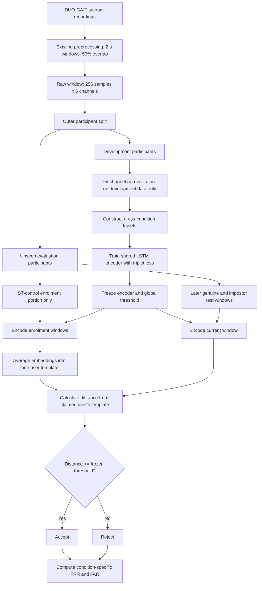

# Condition-Invariant Gait Authentication: Architecture

## 1. Purpose

The existing statistical-feature RBF-SVM is the frozen baseline. It shows that a verifier enrolled with normal single-task walking can fail when the same participant is fatigued, performs a cognitive task, returns in a later session, or experiences sensor reattachment.

The proposed system asks a new question:

> Can a general encoder learn condition-robust identity information from a development population, so that a previously unseen user can enrol with normal walking only and later be authenticated under unseen conditions?

The new system will be implemented separately. It must not overwrite the baseline models, scores, or results.

## 2. One-sentence design

A shared LSTM encoder is trained with cross-condition triplets from development participants; an unseen user then creates one template from ST-control walking only, and current gait is accepted when its encoded representation is sufficiently close to that template.

## 3. The three populations and stages

The word **training** can refer to two different activities, so this project will use the following terms consistently.

| Term | Meaning | Conditions available |
|---|---|---|
| Model development | Teach the general LSTM what identity should look like across conditions | All four conditions, but development participants only |
| User enrolment | Create a stored reference for a new, unseen user | ST-control only |
| Authentication | Compare current walking with the stored reference | Any condition; these are test samples |

An evaluated participant's ST-fatigue, DT-control, and DT-fatigue recordings are never used for model development, enrolment, threshold selection, early stopping, or hyperparameter selection.

## 4. End-to-end architecture



## 5. Input contract

The proposed model reuses the windows already produced by `src/02_preprocess.py`.

Each example has this conceptual structure:

```python
GaitWindow(
    participant_id="sub_01",
    condition="st_control",
    window_index=42,
    start_sample=5376,
    signal=array(shape=(256, 6)),
)
```

The six channels, in the current stored order, are:

```text
GyrX, GyrY, GyrZ, AccX, AccY, AccZ
```

Important invariants:

- Sampling rate: 128 Hz.
- Window duration: 2 seconds.
- Samples per window: 256.
- Step: 128 samples, producing 50% overlap.
- Sensor: sacrum only.
- Participants: all 16, including `sub_07` after its validated ST-control trim.
- Non-finite values are rejected before model input.

## 6. Participant-disjoint outer evaluation

The 16 participants will be assigned deterministically to four outer folds of four participants each. For each run:

- Twelve participants are the development population.
- Four participants are completely unseen evaluation users.
- The encoder, normalization values, model settings, and global threshold are learned without any data from the four evaluation users.
- The process repeats four times so every participant is evaluated exactly once.

This split is by participant, never by random windows. A test participant cannot appear in the development set under another condition.

Development-only validation is used for early stopping, threshold calibration, and model choices. No final evaluation score may influence those choices.

## 7. Development-stage chronology

Within development participants, recordings retain chronological order. Temporally adjacent overlapping windows must not cross a training/validation boundary. At least one window is discarded at each chronological boundary because adjacent windows share 50% of their raw samples.

Development windows have two roles:

1. **Representation learning:** create triplets and update the encoder.
2. **Development validation:** monitor generalization and calibrate the operating threshold.

Only development participants can perform either role.

## 8. Channel normalization

Raw gyroscope and accelerometer channels have different numerical scales. For each outer fold, calculate one mean and standard deviation for each of the six channels using representation-learning windows from development participants only.

For every sample value:

\[
x' = \frac{x - \mu_{\mathrm{development}}}{\sigma_{\mathrm{development}}}
\]

The six means and six standard deviations are frozen and reused for development validation, unseen-user enrolment, and final authentication.

Evaluation-user data must not contribute to these values.

## 9. Shared LSTM encoder

The encoder converts one raw `256 x 6` window into a compact vector called an **embedding**.

Initial architecture:

```text
256 x 6 normalized window
        -> LSTM layer
        -> dropout
        -> dense layer
        -> 64-number embedding
        -> L2 normalization
```

The first version will be intentionally small because the dataset has only 16 participants. Layer width, dropout, and learning rate are development settings, not final scientific contributions.

L2 normalization gives each embedding a length of one. This prevents the network from appearing to separate people merely by making all numbers larger.

## 10. Triplet contract

A training example contains three windows:

```python
Triplet(
    anchor=window_a,
    positive=window_p,
    negative=window_n,
)
```

It must satisfy:

```text
anchor participant == positive participant
anchor participant != negative participant
anchor file/window != positive file/window
all three participants belong to the development set
```

Triplet categories will be balanced so one abundant or easy condition does not dominate training:

1. Same participant, same condition, different chronological windows.
2. Same participant, ST-control and ST-fatigue.
3. Same participant, ST-control and DT-control.
4. Same participant, ST-control and DT-fatigue.
5. Same participant, two changed conditions.

Negatives initially come from a different development participant. Hard-negative mining is a later ablation, not part of the first working version.

## 11. Triplet loss in plain language

The same encoder processes the anchor, positive, and negative windows:

```text
anchor   -> shared encoder -> anchor embedding
positive -> shared encoder -> positive embedding
negative -> shared encoder -> negative embedding
```

The loss asks the network to make the same person's embeddings closer than different people's embeddings by a margin:

\[
L = \max(d(a,p) - d(a,n) + m, 0)
\]

where:

- `d(a,p)` is the distance between the same person's two windows.
- `d(a,n)` is the distance between different people's windows.
- `m` is a small safety gap, initially 0.2 following the source method.

Training is successful only if same-person cross-condition distances decrease while different-person distances remain larger.

## 12. Enrolment of an unseen user

For an evaluation user, only the chronological ST-control enrolment portion is available.

The frozen encoder converts each enrolment window into an embedding:

\[
z_1, z_2, \ldots, z_N
\]

The stored user template is their average, normalized again to unit length:

\[
T_u = \operatorname{normalize}\left(\frac{1}{N}\sum_{i=1}^{N}z_i\right)
\]

In simple terms, the template is the centre of the user's normal-walking representations. It is one compact numerical reference, not a raw sensor recording and not a separately trained user model.

## 13. Authentication score

For a claimed user `u`, encode the current window as `z` and measure its Euclidean distance from the stored template:

\[
d_u = \lVert z - T_u \rVert_2
\]

Decision rule:

```text
distance <= threshold  -> accept the claim
distance > threshold   -> reject the claim
```

Smaller distance means a closer match. Scores may be stored as `-distance` so that larger values consistently mean a better match, as in the baseline system.

## 14. Threshold policy

The initial proposed system uses one global operating threshold learned from development participants. This reflects a deployable application that must authenticate a new user without seeing that user's future fatigue or dual-task data.

The threshold is chosen from development validation comparisons to control FAR while minimizing FRR. Once selected for an outer fold, it is frozen before any evaluation participant is enrolled or tested.

No threshold is selected separately for ST-fatigue, DT-control, or DT-fatigue.

## 15. Genuine and impostor comparisons

For each unseen claimed user:

- **Genuine comparison:** a later window from that same unseen participant is compared with their template.
- **Impostor comparison:** a window from another unseen participant in the same outer fold is compared with the claimed user's template.

Using only unseen participants as final impostors prevents the encoder from receiving an unfair advantage from having trained on the impostor identities.

## 16. Final evaluation conditions

Every unseen participant is evaluated under four conditions:

| Report label | Data used | Meaning |
|---|---|---|
| Baseline ST-control | Chronologically held-out ST-control | Normal, same-session walking |
| ST-fatigue | Entire eligible test recording | Same visit/task structure after fatigue |
| DT-control | Entire eligible test recording | Dual task plus cross-session/reattachment change |
| DT-fatigue | Entire eligible test recording | Combined dual-task/cross-session and fatigue condition |

The baseline ST-control enrolment and test portions retain guard windows so shared raw samples cannot appear on both sides.

## 17. Metrics

For each claimed participant and condition:

```text
FRR = genuine windows incorrectly rejected / all genuine windows
FAR = impostor windows incorrectly accepted / all impostor windows
```

The primary report is the participant-level macro-average, giving every participant equal weight. The proposed results must be compared with the frozen baseline under the same metric definitions.

The result table will have this form:

| Condition | Baseline FRR | Proposed FRR | Baseline FAR | Proposed FAR | Relative change |
|---|---:|---:|---:|---:|---:|
| ST-control | 1.57% | TBD | 1.40% | TBD | TBD |
| ST-fatigue | 11.70% | TBD | 11.19% | TBD | TBD |
| DT-control | 20.97% | TBD | 10.93% | TBD | TBD |
| DT-fatigue | 51.04% | TBD | 14.59% | TBD | TBD |

## 18. Leakage checks that must fail loudly

The implementation will include assertions for all of the following:

```text
development participants intersect evaluation participants == empty
evaluation participants used in normalization == false
evaluation participants used in triplets == false
anchor identity equals positive identity
anchor identity differs from negative identity
evaluation changed conditions used in enrolment == false
evaluation data used in threshold calibration == false
overlapping ST-control raw samples cross enrolment/test boundary == false
```

These are correctness requirements, not optional diagnostics.

## 19. Planned code boundaries

The new implementation will live separately from the baseline:

```text
src/condition_invariant/
    config.py          fixed paths and experiment settings
    records.py         GaitWindow metadata structure
    dataset.py         load raw windows and labels
    folds.py           participant-disjoint outer folds
    triplets.py        balanced triplet sampling
    model.py           shared LSTM encoder and triplet loss
    train.py           development training and early stopping
    enrollment.py      build unseen-user ST-control templates
    scoring.py         distances and authentication decisions
    metrics.py         participant FRR/FAR and macro summaries
    run_experiment.py  execute and save all four outer folds

tests/condition_invariant/
    test_dataset.py
    test_folds.py
    test_triplets.py
    test_enrollment.py
    test_metrics.py
```

Outputs will use new directories such as:

```text
src/models/condition_invariant/
src/results/condition_invariant/
```

## 20. Implementation order

The files will be built and explained in this order:

1. `config.py`, `records.py`, and `dataset.py`
2. `folds.py` and participant-leakage tests
3. `triplets.py` and triplet-validity tests
4. `model.py` and a tensor-shape test
5. Tiny-data overfitting check
6. `train.py` and one pilot outer fold
7. `enrollment.py` and `scoring.py`
8. `metrics.py` and metric unit tests
9. Full four-fold experiment
10. Ablations only after the basic method works

## 21. First-version boundaries

The first working version will not include:

- A generative model.
- Motion forecasting.
- A Transformer.
- Hard-negative mining.
- Temporal score fusion.
- Condition-specific thresholds.
- Changed-condition enrolment for evaluation users.

These may become controlled follow-up experiments. Keeping them out of version one makes it possible to determine whether cross-condition triplet learning itself solves any part of the problem.

## 22. Success criteria

Before looking for large error reductions, the implementation must demonstrate:

1. No participant leakage.
2. Decreasing training loss on a tiny controlled dataset.
3. Same-person distances smaller than different-person distances on development validation data.
4. A frozen threshold selected without evaluation-user data.
5. Reproducible fold assignments and results from a fixed seed.

Only after these checks pass will FRR/FAR improvement be interpreted as evidence that the proposed method helps.
